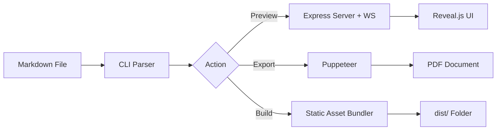

# 🛩️ Slide-Deck-CLI

<p align="center">
  
</p>

<h3 align="center">The God-Tier Markdown to Presentation Engine</h3>

<p align="center">
  <strong>Transform your Markdown into stunning, interactive Reveal.js presentations in seconds.</strong>
</p>

<p align="center">
  <a href="https://github.com/YOUR_USERNAME/slide-deck-cli/actions/workflows/ci.yml">
    
  </a>
  <a href="LICENSE">
    
  </a>
  <a href="https://nodejs.org">
    
  </a>
  <a href="https://github.com/prettier/prettier">
    
  </a>
</p>

---

## 📽️ Demo


> *Note: Imagine a sleek GIF here showing a side-by-side terminal and browser. The terminal runs `slide-deck talk.md`, and the browser instantly renders a beautiful slide. As the code is edited, the browser refreshes flawlessly.*

---

## 🔥 Why Slide-Deck-CLI?

Most presentation tools are either too complex (PowerPoint/Keynote) or too rigid (basic Markdown engines). **Slide-Deck-CLI** gives you the best of both worlds:

- ✍️ **Write in Markdown**: Focus on content, not formatting.
- ✨ **Reveal.js Magic**: Access high-end transitions, vertical slides, and mobile-friendly touch support.
- 🔄 **Hot Reload**: Real-time feedback loop. Save → See → Succeed.
- 📦 **Zero Config**: It just works. But it's also highly extensible.

---

## 🛠️ Features

- ⚡ **Near-Instant Live Reload**: Powered by WebSockets for sub-millisecond updates.
- 🎨 **Code Syntax Highlighting**: Automatic language detection for your snippets.
- 📄 **Export to PDF**: Professional-quality handouts using Puppeteer's headless engine.
- 🚀 **Static Site Generator**: One-command export for GitHub Pages or Netlify.
- 🛡️ **Built-in Quality**: CI/CD ready with pre-commit hooks to keep your repo pristine.

---

## 🚀 Getting Started

### Installation

```bash
# Clone the universe
git clone https://github.com/YOUR_USERNAME/slide-deck-cli.git
cd slide-deck-cli

# Install dependencies
npm install

# Link to your system
npm link
```

### Usage

```bash
# Start the magic
slide-deck presentation.md

# Custom port
slide-deck presentation.md --port 9000

# Export for the boss (PDF)
slide-deck presentation.md --pdf

# Build for the web (Static site)
slide-deck presentation.md --build
```

---

## 📐 How It Works



---

## 🤝 Contributing & Community

We believe in high-quality code and respectful collaboration.

- **[Contributing Guide](CONTRIBUTING.md)**: How to set up your dev environment.
- **[Code of Conduct](CODE_OF_CONDUCT.md)**: Our promise to keep this community safe.
- **[Security Policy](SECURITY.md)**: Reporting vulnerabilities.
- **[Issue Templates](.github/ISSUE_TEMPLATE/)**: Helping us help you.

---

## 🛡️ Pre-Commit Quality Checks

We hate broken builds. This repo comes with **Husky** and **lint-staged**:
- **On Commit**: Automatically runs ESLint and Prettier on changed files.
- **On Push**: Automatically runs the Jest test suite.
- **On GitHub**: Full CI suite ensures every PR is high-quality.

---

## 📄 License

This project is licensed under the **MIT License**. Build something awesome!

---

<p align="center">
  Made with ❤️ by the Slide-Deck-CLI Team
</p>
